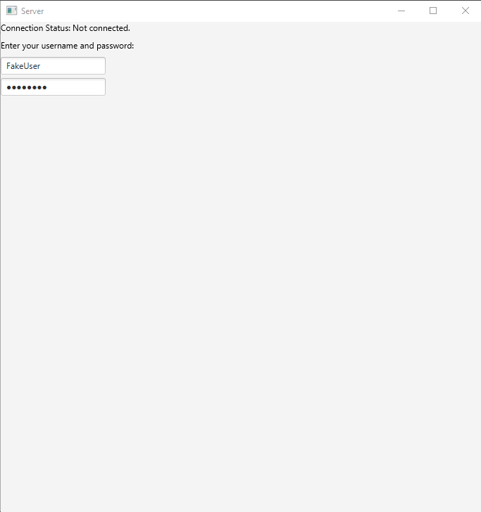
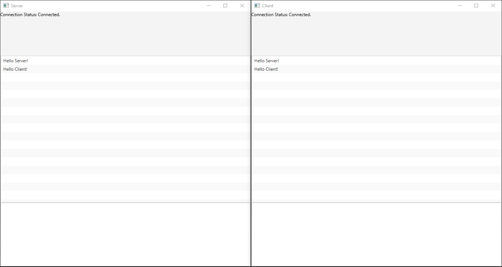
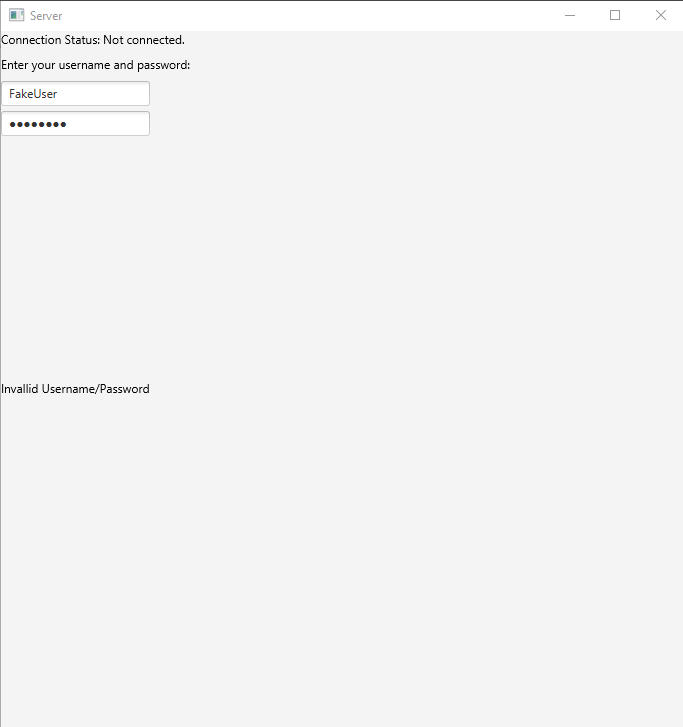
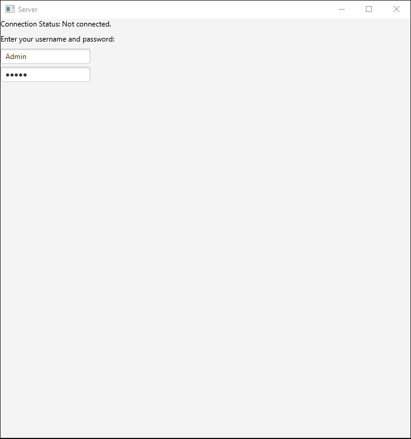
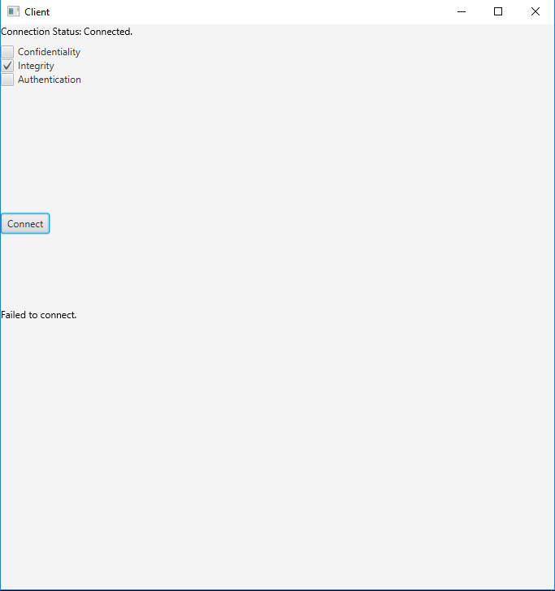
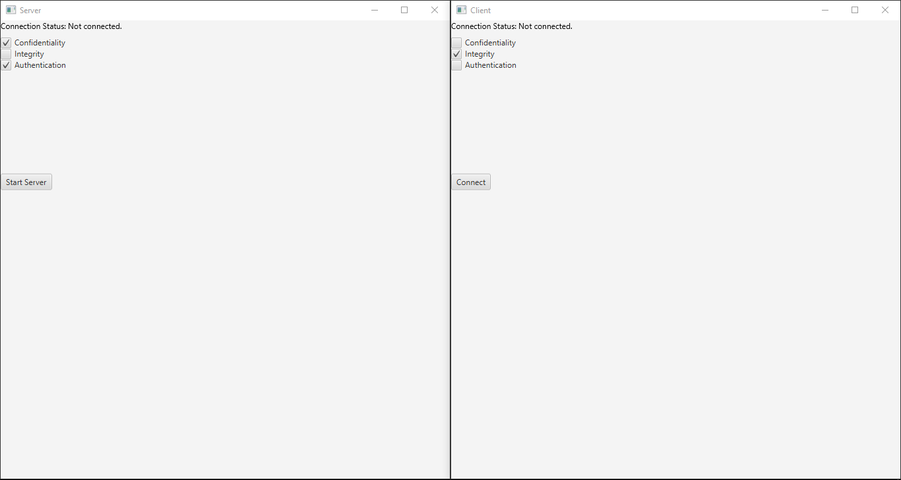

# Crypto-IM

## Introduction

Brief Overview

The Crypto-IM project is a cryptographically secure instant messaging
application developed in Java. It allows users to choose what security
constraints they desire for their chat, sign in, and then begin messaging a
second party. The application implements two-way communication between two
parties, the server and the client.

## Dependencies

In order to run *Crypto-IM* you will need to install the following:

- [git](https://git-scm.com/) (optional)
- [java 9](http://www.oracle.com/technetwork/java/javase/downloads/jdk9-downloads-3848520.html)

*Crypto-IM* has no further dependencies!

## Build/Installation

To install *Crypto-IM* you can either hit the **Clone or download** button
at the top of this repository, or use git to clone:

```bash
$ git clone https://github.com/ejrbuss/Crypto-IM
```

To build the project you can either import the project into the
[Eclipse IDE](https://www.eclipse.org/home/index.php) or run the following
commands on the command line. Ensure that your current working directory is
the root of this repository.

To compile the project run:

```bash
$ javac -d bin src/com/local/se360/*.java
```

### Running Crypt-IM

Once compiled, the program can be started from the root directory of the
repository. Run the server program with:

```bash
$ java -cp ./bin com.local.se360.Server
```

Run the client program with:

```bash
$ java -cp ./bin com.local.se360.Client
```

## Design Decisions

### Java & Javax Libraries

- [**javafx**](https://docs.oracle.com/javase/8/javafx/api/toc.htm)
UI library
- [**java.net**](https://docs.oracle.com/javase/7/docs/api/java/net/package-summary.html)
Socket programming
- [**java.security**](https://docs.oracle.com/javase/7/docs/api/java/security/package-summary.html)
Signing and signature verification, user authentication
- [**javax.crypto**](https://docs.oracle.com/javase/7/docs/api/javax/crypto/package-summary.html)
Symmetric encryption/decryption

### Cryptography Approaches

#### *Confidentiality:* Symmetric Encryption/Decryption

128 bit AES was used for Symmetric Key Encryption/Decryption.

#### *Integrity:* Signing and Signature Verification

256 bit RSA encryption with MD5 hashing was used for signature creation and
verification.

#### *Authentication:* User Authentication

The SHA-256 hasing algorithm was used to hash user passwords which were
then stored in a file for use when authenticating.

## Limitations

Because *Crypto-IM* conducts an unecrypted diffie hellman key exchange
it is vulnerable to a man in the middle attack during the client and
server's first to handshake packets. For this to be resolved a certificate
authority would need to correspond with the client and server or the public
keys of both parties would have to be previously distributed.

## User Walkthrough

1. Open server and client application

2. Select desired security constraints for the server

3. Click "Start Server"

6. If authentication was chosen the user must now sign in on the server



4. Select matching security constraints for the client

5. Click "Connect"

7. If authentication was chosen the user must now sign in on the client

8. Start typing and press Enter to send a message



## Test Username and Passwords

**Username:** Admin **Password:** admin
**Username:** User1 **Password:** password

### Screenshots



*Screenshot 1: Invalid username*



*Screenshot 2: Server Screen Authentication*



*Screenshot 3: Client failed to connect*



*Screenshot 4: Client and Server don't match*


*Screenshot 5: Server and Client send messages*


*Screenshot 6: FakeUser login*